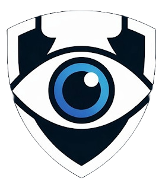

<div align="center">
  
  <h1>CVSentry Cloud System</h1>
  
  <strong>The central nervous system for a globally distributed, AI-powered surveillance network.</strong>
</div>

---

## Table of Contents

- [Deep Dive: What Makes CVSentry Special](#deep-dive-what-makes-cvsentry-special)
- [Project Architecture](#project-architecture)
- [Environment Configuration](#environment-configuration)
- [Setup Instructions](#setup-instructions)
- [Desktop Client Reference](#desktop-client-reference)
- [License](#license)

---

## Deep Dive: What Makes CVSentry Special

CVSentry is not just a standard video management system; it is a distributed, proactive threat-detection pipeline. While the **Desktop Client** runs on-premise to handle heavy AI inferences, this **Cloud System** serves as the global orchestrator. 

What it does uniquely:
1. **Centralized Edge Management**: It tracks the lifecycle, health, and IP addresses of distributed edge nodes globally. You can manage a fleet of localized camera networks from a single pane of glass.
2. **Global Identity Synchronization**: The system maintains a central vector database of known identities. When a new person of interest is added in the cloud, the identity embeddings are automatically synchronized to all edge nodes in the field.
3. **WebRTC Cloud Relay & NAT Traversal**: Using Cloud SRS and CoTURN, edge nodes publish extremely low-latency streams via WebRTC (WHIP) directly to the cloud. This gracefully bypasses complex local firewalls and NATs, allowing authorities to view live feeds from any browser via WHEP.
4. **Synchronized HLS Recording & Metadata**: It securely stores continuous video feeds in a MinIO S3 bucket, perfectly synchronized with frame-by-frame detection metadata. The dashboard provides a "Threat Timeline" seeker bar, color-coded by severity, allowing users to instantly jump to the exact moment a weapon was detected across weeks of historical footage.

## Project Architecture

```text
CVSentry/
├── core/                    # Django REST API backend
│   ├── api/                 # Django project settings and global routing
│   ├── auth/                # Custom authentication (RS256 JWT)
│   ├── nodes/               # Edge node management and heartbeat
│   ├── alerts/              # Threat alert aggregation
│   ├── faces/               # Central face identity management
│   ├── recordings/          # WebRTC stream callbacks and HLS recording management
│   ├── srs/                 # SRS configuration files
│   ├── .env                 # Backend environment variables
│   ├── Dockerfile           # Docker setup for backend
│   └── requirements.txt     # Python dependencies
│
├── dashboard/               # React (TypeScript) + Vite SPA
│   ├── src/                 # UI components and WHEP/hls.js players
│   ├── .env                 # Frontend environment variables
│   ├── package.json         # Node dependencies
│   └── vite.config.ts       # Vite configuration
│
└── docker-compose.yaml      # PostgreSQL, Django, Qdrant, MinIO, SRS, and CoTURN
```

## Environment Configuration

You must configure the environment variables before starting the system.

### 1. Backend Configuration (`core/.env`)

Create a `.env` file inside the **core/** directory. Refer to `core/.env.example` for the complete list.

```env
# Database
POSTGRES_DB=
POSTGRES_HOST=
POSTGRES_USER=
POSTGRES_PASSWORD=
POSTGRES_PORT=

# Django Settings
SECRET_KEY=
DEBUG=True
DASHBOARD_URL=http://localhost:5173

# MinIO (Video Storage)
MINIO_ROOT_USER=minioadmin
MINIO_ROOT_PASSWORD=
MINIO_ENDPOINT=minio:9000
MINIO_EXTERNAL_URL=http://localhost:9000
MINIO_BUCKET=cvsentry-recordings

# SRS (WebRTC & HLS Streaming)
SRS_CANDIDATE=127.0.0.1
SRS_API_PASSWORD=
SRS_EXTERNAL_API_URL=http://localhost:1985
SRS_WHEP_TOKEN_SECRET=
SRS_WHEP_TOKEN_TTL_SECONDS=30
RECORDING_RETENTION_DAYS=7

# CoTURN (NAT Traversal)
TURN_SHARED_SECRET=
TURN_EXTERNAL_IP=
TURN_REALM=cvsentry.local
TURN_MIN_PORT=49152
TURN_MAX_PORT=65535
TURN_CREDENTIAL_TTL=86400

# Email (OTP & Verification)
EMAIL_HOST_USER=
EMAIL_HOST_PASSWORD=
```

### 2. Frontend Configuration (`dashboard/.env`)

Create a `.env` file inside the **dashboard/** directory:

```env
VITE_BACKEND_URL=http://localhost:8000
```

## Setup Instructions

### Backend Setup

Ensure Docker and Docker Compose are installed on your system.

```bash
docker-compose up --build
```

This command will initialize the PostgreSQL database, Qdrant vector store, MinIO object storage, SRS streaming server, CoTURN, and the Django API. The API will be exposed on `http://localhost:8000`.

### Frontend Setup

Navigate to the dashboard directory and start the development server:

```bash
cd dashboard
npm install
npm run dev
```

The application will be accessible at `http://localhost:5173`.

## Desktop Client Reference

For the edge node orchestrator that ingests RTSP streams, processes AI inferences locally, and streams data up to this cloud system, see the [CVSentry Desktop Client](https://github.com/mrnobo09/CVSentry-Desktop-Client).

## License

This project is open-source. Anyone is free to self-host, customize, and use it.